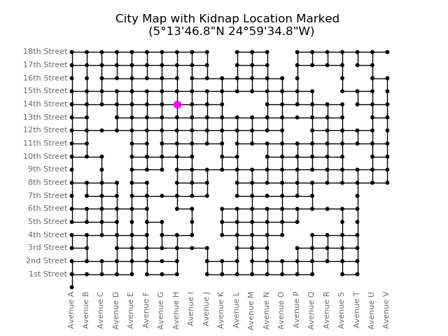
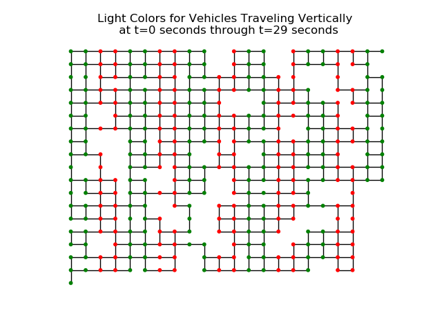
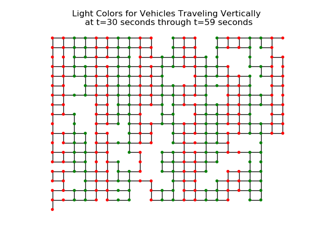
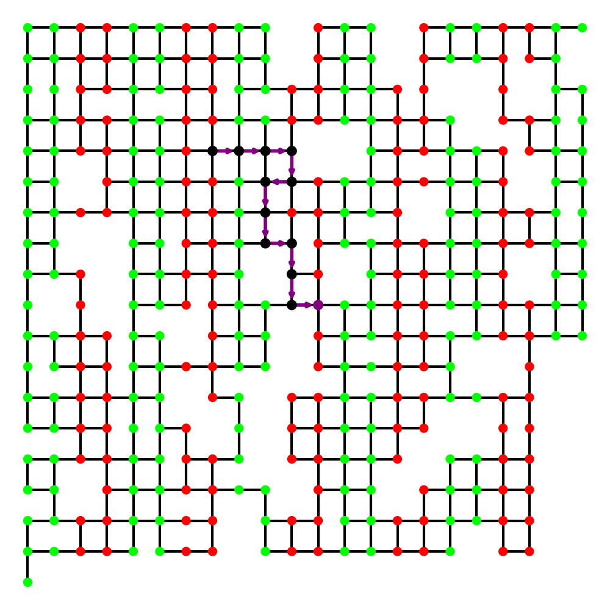

# Task 4 - Follow That Car!

### (Graph Algorithms, Computer Science)

#### Points: 500

By using the credentials in the decrypted file, we were able to download the journalist's accelerometer data from their Stepinator device from the time of the kidnapping. Local officials have provided us with a city map and traffic light schedule. Using these along with the journalist's accelerometer data, find the closest intersection to where the kidnappers took their hostage.

### Provided files

* Relevant information for solving the problem (`README.txt`)
* Acceleration data (`stepinator.json`)
* City map and traffic light schedule (`maps.zip`)

### Prompt

* Enter the avenue of the intersection. (ie. Avenue F & 3rd st, enter F)
* Enter the street of the intersection (ie. Avenue F & 3rd st, enter 3)

### Prerequisites

```
~$ pip3 install geopandas momepy networkx matplotlib
```

## Solution

We begin by reading the `README.txt`. It states that the location where the journalist was kidnapped has been marked on the included city map.

We therefore extract `maps.zip`.

```
~$ unzip maps.zip
~$ ls
maps maps.zip  README.txt stepinator.json
~$ tree maps
maps
├── city-lights-vertical-0_29.png
├── city-lights-vertical-30_59.png
├── city-map.png
└── city-shapefile
    ├── edges.dbf
    ├── edges.shp
    ├── edges.shx
    ├── nodes.dbf
    ├── nodes.shp
    └── nodes.shx
```

We look at `city-map.png`.



We can see that the journalist was kidnapped at the intersection of `Avenue H` and `14th Street`, giving us the journalist's initial position.

The `README.txt` proceeds to say that the kidnapper headed directly East, giving us the direction of the journalist's initial velocity.

The `README.txt` then says that the file `stepinator.json` contains a list of lateral acceleration values (in m/s^2) for each second starting at the time of the kidnapping.

```json
~$ cat stepinator.json
[1.5, 1.5, 1.5, 1.5, 1.5, 1.5, 1.5, 1.5, 1.5, -0.5, -2.51, -4.5, -4.5, -1.49, 0, 0, 0, 0, 0, 0, 0,
 0, 0, 0, 0, 0, 0, 0, 0, 0, 1.5, 1.5, 1.5, 1.5, 1.5, 1.5, 1.5, 1.5, 1.5, 0, 0, 0, 0, 0, 0, 0, 0,
 -0.833, -4.5, -4.5, -3.667, 0, 0, 0, 0, 0, 0, 0, 0, 0, 1.5, 1.5, 1.5, 1.5, 1.5, 1.5, 1.5, 1.5, 1.5,
 -0.5, -2.51, -4.5, -4.5, -1.49, 0, 0, 0, 0, 0, 0, 0, 0, 0, 0, 0, 0, 0, 0, 0, 0, 1.5, 1.5, 1.5, 1.5,
 1.5, 1.5, 1.5, 1.5, 1.5, 0, -0.846, -4, -4, 1.5, 1.5, 1.5, 1.5, 1.5, 1.5, 0, -2.345, -4.5, -4.5,
 -2.309, 0, 0, 0, 0, 0, 0, 1.5, 1.5, 1.5, 1.5, 1.5, 1.5, 1.5, 1.5, 1.5, 0, -0.846, -4, -4, 1.5, 1.5,
 1.5, 1.5, 1.5, 1.5, 0, -0.527, -4, -4, 1.5, 1.5, 1.5, 1.5, 1.5, 1.5, -1.127, 0, 0, 0, 0, 0, 0, 0,
 0, -2.672, -4, 1.5, 1.5, 1.5, 1.5, 1.5, 0, -0.828, -3.828, -4.5, -4.5, -0.172, 0, 0, 0, 0, 0, 0, 0,
 0, 0]
```

The `README.txt` also says that the journalist was kidnapped just as the lights changed colour, implying that his initial speed was 0.

We can therefore use kinematics equations to convert the acceleration data to instantaneous speed and displacement data.

```python
#!/usr/bin/python3
# find_hostage.py
from json import load

with open('stepinator.json') as f:
	a = load(f) # acceleration data
v = [0.0] # speed data
disp = [0.0] # displacement data
for ax in a:
	disp.append(v[-1]+0.5*ax)
	v.append(v[-1]+ax)
```

Next, we convert the provided shapefile data to an undirected graph representation of the city. Nodes represent intersections and edges represent roads.

```python
import networkx as nx
from geopandas import read_file
from momepy import gdf_to_nx

G = gdf_to_nx(read_file('maps/city-shapefile/edges.shp'))
```

Printing the nodes of `G` shows us that the shapefile represented nodes as tuples of x-y coordinates with the intersection of `Avenue A` and `1st Street` representing the origin.

Next, we look at the city's traffic light information in `city-lights-vertical-0_29.png` and `city-lights-vertical-30_59.png`.





The `README.txt` states that each light has a cycle of 30 seconds green, 30 seconds red. If a light is green for vehicles traveling through the intersection vertically, it will be red for those traveling horizontally (and vice versa).

We see that the colour of a light depends only on the x position of the node the light represents. We can therefore code a simple modular function to determine whether the light is green at a given node at given time.

```python
GREEN = '#00ff00'
RED = '#ff0000'

def node_colour(node, t):
	return GREEN if (t%60 < 30 and node[0]%400 < 200) or (t%60 >= 30 and node[0]%400 >= 200) else RED
```

We can extend this function to also tell us whether the light is green for a vehicle travelling in a given direction through an intersection at a given time.

```python
def is_green(node, t, d):
	colour = node_colour(node, t)
	return True if (colour == GREEN and d[1]) or (colour == RED and d[0]) else False
```

The `README.txt` proceeds to state that the kidnappers likely slow down when they take a right or left turn and that we may assume that once an intersection was traversed, that intersection was not revisited.

We may therefore use a simple breadth-first search (BFS) traversal algorithm through the graph subject to the constraints described in the `README.txt` (though depth-first search would work equally well).

We define a simple data structure to represent a possible path through the graph.

```python
class Path:
	def __init__(self, t, pos, d, visited):
		self.t = t # time
		self.pos = pos # position
		self.d = d # direction vector
		self.visited = visited # visited nodes
```

We keep a list of all candidate paths at a given time and create a simple function to traverse in a BFS manner.

```python
def explore(paths):
	for path in paths:
		if path.t < len(a):
			return path
	return None
```

We now implement the main algorithm that takes into account the displacement, speed, and acceleration data, as well as the light colours. We have to factor in for the fact that the kidnappers wouldn't stop at a green light for a long period of time and would slow down before turning. The `README.txt` states that each city block is about 100m long, which the shapefile tuple data confirms.

```python
BLOCK = 100.0 # block size in metres

def tup_scalar_mul(scalar, tup):
	return tuple(x*scalar for x in tup)

def add_tups(tup1, tup2):
	return tuple(map(lambda x,y: x+y, tup1, tup2))

def next_node(path, paths):
	m = len(a)
	disp_from_prev = abs(path.pos[0]-path.visited[-1][0])%int(BLOCK) if path.d[0] else \
				     abs(path.pos[1]-path.visited[-1][1])%int(BLOCK)

	t_stopped = t_slowed = 0
	while disp_from_prev < BLOCK and path.t < m:
		disp_from_prev += disp[path.t]
		path.t += 1
		if not t_stopped and round(v[path.t], 2) == 0.0:
			t_stopped = path.t
		elif path.t < m:
			if not t_slowed and a[path.t] < 0.0:
				t_slowed = path.t
			elif t_slowed and a[path.t] > 0.0 and a[path.t-1] < 0.0:
				t_slowed = path.t

	extra = 0.0
	if disp_from_prev >= BLOCK:
		extra = disp_from_prev - BLOCK
		disp_from_prev = BLOCK

	path.pos = add_tups(path.visited[-1], tup_scalar_mul(disp_from_prev, path.d))

	if disp_from_prev < BLOCK:
		path.pos = tuple(round(x/BLOCK) * BLOCK for x in path.pos)

	if t_stopped and not t_slowed and is_green(path.pos, t_stopped, path.d):
		paths.remove(path)
		return explore(paths)
	
	must_turn = t_slowed and is_green(path.pos, t_slowed, path.d)

	path.visited.append(path.pos)

	if disp_from_prev < BLOCK:
		if not is_green(path.pos, path.t, path.d):
			paths.remove(path)
	else:
		for x,y in list(G.__getitem__(path.pos)):
			if (x,y) not in path.visited:
				d = tuple(1 if u > p else -1 if u < p else 0 for u,p in zip((x,y), path.pos))
				good = False
				if t_stopped:
					if not is_green(path.pos, t_stopped, path.d):
						good = True
				elif t_slowed and must_turn:
					if d != path.d:
						good = True
				elif d == path.d and is_green(path.pos, path.t, d):
					good = True
				if good:
					paths.append(Path(t=path.t, pos=add_tups(path.pos,
								 tup_scalar_mul(extra, d)), d=d,
								 visited=path.visited.copy()))
		paths.remove(path)

	return explore(paths)
```

It's not the most elegant code, but it should work.

We may therefore convert the intersection of `Avenue H` and `14th Street` to a set of coordinates.

```python
import sys

AVES = [chr(c) for c in range(ord('A'),ord('V')+1)]
ST_SUFS = ['st','nd','rd']+['th']*15

def intersection_to_pos(intr):
	return AVES.index(intr[0])*BLOCK, (intr[1]-1)*BLOCK

def pos_to_intersection(pos):
	st = int(path.pos[1]/BLOCK)+1
	return AVES[int(pos[0]/BLOCK)], str(st)+ST_SUFS[st-1]

intr = (sys.argv[1], int(sys.argv[2]))
print('Kidnapped at Ave %s & %i%s St'%(intr[0],intr[1],ST_SUFS[intr[1]-1]))
```

We also know that the initial direction of the kidnappers' velocity was `(1,0)`. We can therefore use the initial position to create the first path then use a simple loop to traverse the graph and update the path list as long as valid paths remain.

```python
pos = intersection_to_pos(intr)
curr_path = Path(t=0, pos=pos, d=(1,0), visited=[pos])
paths = [curr_path]

while curr_path:
	curr_path = next_node(curr_path, paths)
```

When one path remains, we print the final intersection and save an image representation of the path to a file `path.png`.

```python
path = paths[0]

intr = pos_to_intersection(path.pos)
print('Hostage taken to Ave', intr[0], '&', intr[1], 'St')

plt.figure(figsize=(10,10))
nx.draw(G, pos={n:n for n in G.nodes()}, node_size=100,
		node_color=[node_colour(n, path.t) for n in G.nodes()], width=3)

Gp = nx.DiGraph()
if len(path.visited) > 1:
	for n in range(len(path.visited)-1):
		Gp.add_edge(path.visited[n], path.visited[n+1])
else:
	Gp.add_node(path.visited[-1])
nx.draw(Gp, pos={n:n for n in Gp.nodes()}, arrowstyle='->', node_size=125,
		node_color=['#800080' if node==path.pos else '#000000' for node in Gp.nodes()],
		edge_color='#800080', width=4)
plt.savefig('path.png')
```

We finally run our algorithm.

```
~$ ./find_hostage.py H 14
Kidnapped at Ave H & 14th St
Hostage taken to Ave L & 9th St
```

This is the generated `path.png` image.



Therefore, the intersection of `Avenue L` and `9th Street` is the closest to where the kidnappers took their hostage.

### Answer

* Enter the avenue of the intersection. (ie. Avenue F & 3rd st, enter F)
  * `L`
* Enter the street of the intersection (ie. Avenue F & 3rd st, enter 3)
  * `9`

## Author

* **Aviv Brook**