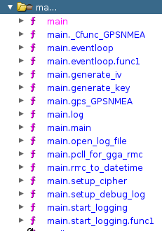
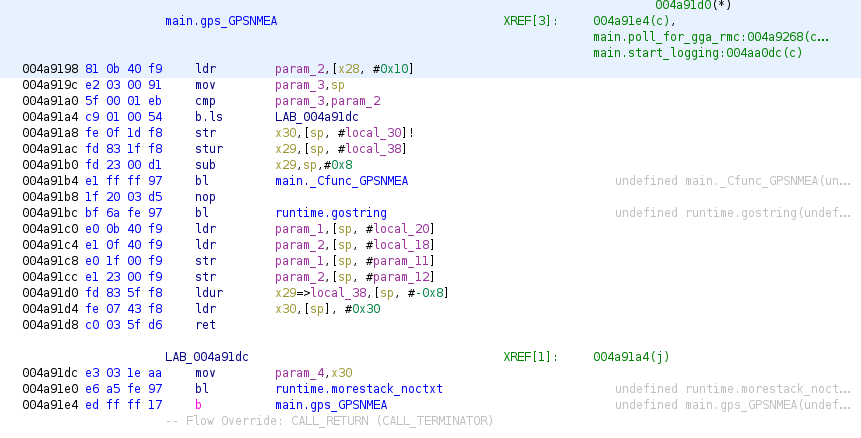
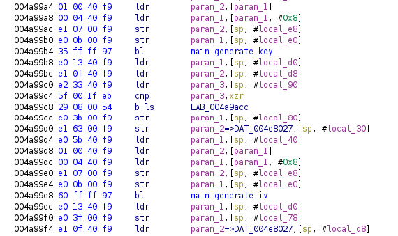
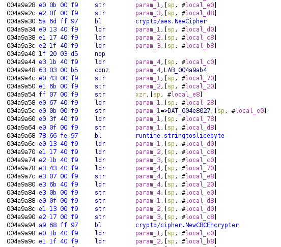
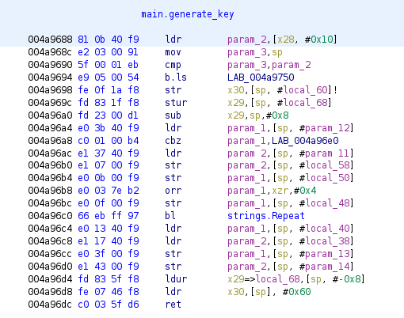
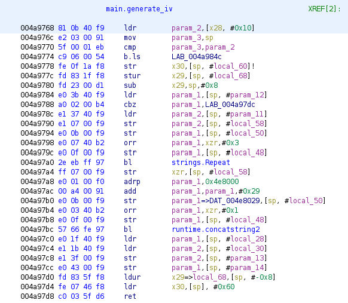

# Task 5 - Where Has the Drone Been?

### (Reverse Engineering, Cryptography)

#### Points: 1300

A rescue team was deployed to the criminal safehouse identified by your efforts. The team encountered resistance but was able to seize the location without causalities. Unfortunately, all of the kidnappers escaped and the hostage was not found. The team did find two important pieces of technology left behind: the journalist's Stepinator device, and a damaged surveillance drone. An analyst retrieved some encrypted logs as well as part of the drone's GPS software. Your goal for this task is to identify the location of the criminal organization's base of operations.

### Provided files

* Interesting looking binary... (`gpslogger`)
* Recovered log files (`logs.tgz`)

### Prompt

* Enter the approximate location of the organization's base in the format: ##°##'N ##°##'W

### Prerequisites

```
~$ apt install qemu-system-arm gcc-aarch64-linux-gnu openssl
```

## Solution

We suspect that the coordinates we're looking for are somewhere in the log files so we begin by extracting them.

```
~$ tar zxvf logs.tgz
~$ ls
Logs  logs.tgz
~$ cd Logs
~$ ls
20200628_153027.log  20200630_161219.log  20200723_183021.log  20200920_154004.log
~$ file *
20200628_153027.log: data
20200630_161219.log: data
20200723_183021.log: OS9/68K module: re-entrant ghost
20200920_154004.log: data
```

Unfortunately, the logs are encrypted and we cannot discern any information from their file structure. The `OS9/68K module` result is likely a mistake since all the logs were supposedly generated by the same program and should have the same file type. It's very likely that the `gpslogger` binary is what generated these logs, so we'll have to try to reverse engineer it for clues.

We inspect the binary.

```
~$ file gpslogger
gpslogger: ELF 64-bit LSB executable, ARM aarch64, version 1 (SYSV), dynamically linked, interpreter
/lib/ld-musl-aarch64.so.1, Go BuildID=kuiME-kEtOrjYr0NtuSC/F9nT4PAOBdJwNF6rCoCc/7l0D-CmOuZoubD_SqInN/
JtxNTIAPCIxt045aNaaC, not stripped
```

The good news is that the binary is not stripped, so it will make it easier to reverse engineer in a software such as Ghidra. The bad news is that this binary was compiled for ARM64 and we are using an x86 system. We therefore need to emulate aarch64 if we want to run the binary. We see that `gpslogger` was compiled with `musl` and that it was programmed in `Go`.

We can try to find some more information about the binary using `readelf`.

```
~$ readelf -p .comment gpslogger

String dump of section '.comment':
  [     0]  GCC: (Alpine 9.3.0) 9.3.0
```

We can see that this binary was compiled with GCC 9.3.0 on Alpine Linux. We go to the [Alpine Linux website](https://alpinelinux.org/) and see that [Alpine Linux v3.12.0](https://alpinelinux.org/posts/Alpine-3.12.0-released.html) has GCC 9.3.0. In order to run this binary, we will use QEMU. To save trouble, we want to emulate a similar runtime to the one on which the binary was compiled. We will therefore emulate Alpine Linux v3.12.0. We need to download the Alpine Linux kernel and disk image.

```
~$ wget https://dl-cdn.alpinelinux.org/alpine/edge/releases/aarch64/netboot-3.12.0/vmlinuz-lts
~$ wget https://dl-cdn.alpinelinux.org/alpine/edge/releases/aarch64/netboot-3.12.0/initramfs-lts
```

We now run our emulator.

```
~$ qemu-system-aarch64 -M virt -m 512M -cpu cortex-a57 -kernel vmlinuz-lts -initrd initramfs-lts -append
   "console=ttyAMA0 ip=dhcp alpine_repo=http://dl-cdn.alpinelinux.org/alpine/edge/main/" -nographic
```

When it is done loading, we log in and install some basic tools so that we can work somewhat comfortably within our emulated environment.

```
localhost login: root
[Alpine]:~# apk add --update --no-cache vim gdb tmux curl gcc musl-dev
```

We now send a copy of the `gpslogger` binary to our emulator using `bashupload`.

```
[Kali]:~$ curl https://bashupload.com/gpslogger --data-binary @gpslogger

=========================

Uploaded 1 file, 2 384 344 bytes

wget https://bashupload.com/GpxLB/gpslogger

=========================
```

```
[Alpine]:~# wget https://bashupload.com/GpxLB/gpslogger
[Alpine]:~# chmod +x gpslogger
```

We now try to run our binary.

```
[Alpine]:~# ./gpslogger
Error loading shared library libgps.so: No such file or directory (needed by ./gpslogger)
Error relocating ./gpslogger: GPSNMEA: symbol not found
```

We see that we are missing a shared library. We may try to install the `gpsd-dev` library which does have a file `libgps.so`. We, however, find out that the file from the `gpsd` library does not have the `GPSNMEA` function. No matter how much we search online, there is no function that does what we want for this purpose. Since we ran out of ideas, it's time to open up [Ghidra](https://ghidra-sre.org).

We scan through some of the disassembled functions, mainly those with the `main` prefix.



We notice that the function `main.gps_GPSNMEA` is very likely the function our shared library is missing.



As we inspect it, we notice that the only two functions that call `main.gps_GPSNMEA` are `main.poll_for_gga_rmc` and `main.start_logging`. This might hint to the fact that the `main.gps_GPSNMEA` function should return `GPSNMEA` data in either the `GGA` or `RMC` format. We can find [NMEA documentation](https://navspark.mybigcommerce.com/content/NMEA_Format_v0.1.pdf) describing these formats. Since this is the only function we're missing, maybe we should just implement it ourselves.

Before we jump into that though, we will scan through some more of these functions so that we can get a better idea of how this binary works. We look in the function `main.setup_cipher`. The first notable thing we notice this function do is call `main.generate_key` and `main.generate_iv`.



If we can get some insight into how those two functions work, we could understand how the binary generates encryption keys for the log files and have a better chance at decrypting them. The second notable thing we notice this function do is call `crypto/aes.NewCipher` and `crypto/cipher.NewCBCEncrypter`.



Since we determined earlier that `gpslogger` was programmed in `Go`, we can infer that these are functions from `Go`'s `crypto` package. We would therefore reasonably assume that the log files were encrypted with AES in CBC mode. If we look at the [`crypto` package documentation](https://golang.org/pkg/crypto/aes/), we see that the default block size for AES is 16 bits. This should therefore be the first block size we try. In this case, we expect the program to generate 16-bit IVs.

We will come back to these later. For now, we want to get our binary running. We need to create a function `GPSNMEA`. Based on what we saw in Ghidra, we think that this function has to return GPS messages in the GGA and RMC formats. So, let's first try to understand how these formats look.

In the previous task, the journalist was kidnapped from the location `5°13'46.8"N 24°59'34.8"W`. Let's arbitrarily choose this location and try to convert it to GNGGA and GNRMC strings, while arbitrarily choosing the values for the rest of the fields as well.

```
$GNGGA,233900.669,0513.78,N,02459.58,W,1,8,,100.0,M,,,,
$GNRMC,233900.669,A,00513.78,N,02459.58,W,0.0,,091020,,,A
```

The only thing our strings are missing is their checksums at the end. We can create a simple Python function to compute checksums of NMEA messages.

```python
# checksum.py

def checksum(string):
    c = 0
    for s in string:
    	c ^= ord(s)
    return c
```

```
[Kali]:~$ python3
>>> from checksum import checksum
>>> checksum('$GNGGA,233900.669,0513.78,N,02459.58,W,1,8,,100.0,M,,,,')
61
>>> checksum('$GNRMC,233900.669,A,00513.78,N,02459.58,W,0.0,,091020,,,A')
95
```

We append the checksum to the end to form complete NMEA messages.

```
$GNGGA,233900.669,0513.78,N,02459.58,W,1,8,,100.0,M,,,,*61
$GNRMC,233900.669,A,00513.78,N,02459.58,W,0.0,,091020,,,A*95
```

Let's now try to make a simple C function `GPSNMEA` that alternates between returning these two static strings and see where that takes us.

```C
// libgps.c
#include <stdbool.h>
static bool alt = false;
char *GPSNMEA(void) {
    alt = !alt;
    return alt ? "$GNGGA,233900.669,0513.78,N,02459.58,W,1,8,,100.0,M,,,,*61" :
    			 "$GNRMC,233900.669,A,00513.78,N,02459.58,W,0.0,,091020,,,A*95";
}
```

We can now compile it for aarch64 as a shared library.

```
[Kali]:~$ aarch64-linux-gnu-gcc -shared -o libgps.so -fPIC libgps.c
```

Let's copy this file over to Alpine and see what happens.

```
[Kali]:~$ curl https://bashupload.com/libgps.so --data-binary @libgps.so

=========================

Uploaded 1 file, 8 120 bytes

wget https://bashupload.com/BJ9IR/libgps.so

=========================
```

```
[Alpine]:~# wget https://bashupload.com/BJ9IR/libgps.so
[Alpine]:~# mv libgps.so /usr/lib
```

We run the binary.

```
[Alpine]:~# ./gpslogger
Starting GPS logger.  Awaiting SIGUSR to start/stop. PID: 1958
```

Success! It works. Now, let's set some `gdb` breakpoints and follow the program's logic step-by-step so that we can understand what it's doing. Let's think back to the two functions we saw earlier `main.generate_key` and `main.generate_iv`.



As we can see, `main.generate_key` calls `Go`'s `strings.Repeat` function which implies that the key is a scheme of repeated bits. We would like to find out what the binary uses to generate this key. We also inspect `main.generate_iv`.



We see that `main.generate_iv` also calls `strings.Repeat` but it seems to call `runtime.concatstring2` after as well so we are interested in figuring out what's going on at all those steps. We create a set of `gdb` commands.

```
# .gdbinit
set pagination off
file gpslogger
b main.setup_cipher
b main.generate_key
b main.generate_iv
b strings.Repeat
b runtime.concatstring2
commands
```

When we ran `gpslogger` before, we saw that the binary waits on a signal before it starts doing anything. We therefore want to multiplex our Alpine terminal so that we can send signals to the binary. We start a new Alpine terminal instance.

```
[Alpine]:~# tmux
```

We now run `gpslogger` with `gdb` in our `tmux` instance.

```
[Alpine]:~# gdb
Breakpoint 1 at 0x4a9874: file /src/encryptor/main.go, line 102.
Breakpoint 2 at 0x4a96a4: file /src/encryptor/main.go, line 86.
Breakpoint 3 at 0x4a9784: file /src/encryptor/main.go, line 94.
Breakpoint 4 at 0x4a4474: file /usr/lib/go/src/strings/strings.go, line 524.
Breakpoint 5 at 0x443134: file /usr/lib/go/src/runtime/string.go, line 58.
(gdb) r
Starting program: /root/gpslogger
[New LWP 1984]
[New LWP 1985]
[New LWP 1986]

Thread 1 "gpslogger" hit Breakpoint 5, runtime.concatstring2 (buf=0x0, a=..., ~r2=...) at
	/usr/lib/go/src/runtime/string.go:58
(gdb) c
Continuing.
Starting GPS logger.  Awaiting SIGUSR to start/stop. PID: 1981
[New LWP 1987]
[New LWP 1988]
```

We see that the program is waiting on a `SIGUSR` signal. We therefore press `Ctrl-B D` to switch from our `tmux` instance to our original Alpine terminal instance. From there we send the required signal to PID 1981.

```
[Alpine]:~# kill -s 10 1981
```

We now return to the multiplexed terminal.

```
[Alpine]:~# tmux attach
Thread 1 "gpslogger" received signal SIGUSR1, User defined signal 1.
runtime.futex () at /usr/lib/go/src/runtime/sys_linux_arm64.s:461
(gdb) c
Continuing.
SIGUSR1: start log requested
[Switching to LWP 1988]

Thread 6 "gpslogger" hit Breakpoint 1, main.setup_cipher (input=..., ~r1=...) at /src/encryptor/main.go:102
```

We've reached our first interesting breakpoint! Let's take a look at the arguments being passed to this function.

```
(gdb) i ar
input = 0x4000078040 "$GNGGA,233900.669,0513.78,N,02459.58,W,1,8,,100.0,M,,,,*61"

~r1 = {tab = <optimized out>, data = <optimized out>}
```

Very interesting! The static `GNGGA` string we generated in our `GPSNMEA` function is being passed as input to setup the cipher. This means that the string we created will somehow be used to generate the key and IV to encrypt the log! Given that we saw some calls to `strings.Repeat`, we also expect the key and/or IV to have repeating characters. We keep on following the program's runtime.

```
(gdb) c
Continuing.

Thread 6 "gpslogger" hit Breakpoint 2, main.generate_key (latitude=..., ~r1=...) at /src/encryptor/main.go:86

86      in /src/encryptor/main.go
(gdb) i ar
latitude = 0x4000078052 "0513"
```

We see that the integer component of the latitude string (i.e., the part before the decimal) is given as input to the `main.generate_key` function. Let's see what happens next!

```
(gdb) c
Continuing.

Thread 6 "gpslogger" hit Breakpoint 4, strings.Repeat (s=..., count=4, ~r2=...) at
	/usr/lib/go/src/strings/strings.go:524
```

As we continue, we reach `main.generate_key`'s call to `strings.Repeat`. We see that the count is 4 and the input string is still the integer part of the latitude.

```
(gdb) i ar
s = 0x4000078052 "0513"
count = 4
```

If we recompile the shared library with different strings, we see that this behaviour doesn't change so it seems that 4 is a constant not dependent on any of our inputs. If we continue again, we get to our IV generation.

```
(gdb) c
Continuing.

Thread 6 "gpslogger" hit Breakpoint 3, main.generate_iv (longitude=..., ~r1=...) at /src/encryptor/main.go:94
```

We now know that this program generates the encryption key by taking the integer part of the latitude and repeating it 4 times. By our NMEA formatting, the integer part of the latitude has to be a zero-padded 4-digit integer. Our key is therefore 16 utf-8 characters, which is 16 bytes = 128 bits. So we finally know that we need to use AES in CBC mode with 128 bit keys.

Let's now look at the input to `main.generate_iv`. If it's anything like `main.generate_key`, we would expect this to simply be the integer part of our longitude string.

```
(gdb) i ar
longitude = 0x400007805c "02459"
```

Our hypothesis is correct. We continue to the next step.

```
(gdb) c
Continuing.

Thread 6 "gpslogger" hit Breakpoint 4, strings.Repeat (s=..., count=3, ~r2=...) at
	/usr/lib/go/src/strings/strings.go:524
```

We've reaching the call to `strings.Repeat`.

```
(gdb) i ar
s = 0x400007805c "02459"
count = 3
```

We see that this string once again repeats a string a fixed number of times, this time repeating our length-5 longitude string 3 times. We can once again test different NMEA strings to make sure that the count is indeed a constant. However, notice that if we repeat our length-5 string 3 times, we get a string of length 15. But, since we expected our block size to be 16, the IV needs to be of length 16 as well. We continue tracing the program.

```
(gdb) c
Continuing.

Thread 6 "gpslogger" hit Breakpoint 5, runtime.concatstring2 (buf=0x0, a=..., ~r2=...) at
	/usr/lib/go/src/runtime/string.go:58
(gdb) i ar
buf = 0x0
a = {0x4e8029 "0", 0x4000018140 "024590245902459"}
```

As we can see, it is concatenating the string `0` with the string `024590245902459`, which is just the integer part of the longitude repeated 3 times! This generates an IV of length 16, confirming our hypothesis that the block size is 16.

We got most of the information we needed. Let's continue through the program to see what else we can find.

```
(gdb) c
Continuing.

Thread 6 "gpslogger" hit Breakpoint 5, runtime.concatstring2 (buf=0x0, a=..., ~r2=...) at
	/usr/lib/go/src/runtime/string.go:58
58      in /usr/lib/go/src/runtime/string.go
```

We see that the binary calls `runtime.concatstring2` again. But since we saw in Ghidra that `main.generate_iv` only calls `runtime.concatstring2` once, we must be in a different context.

```
(gdb) bt
#0  runtime.concatstring2 (buf=0x0, a=..., ~r2=...) at /usr/lib/go/src/runtime/string.go:58
#1  0x00000000004a95cc in main.rmc_to_datetime (rmc=..., ~r1=...) at /src/encryptor/main.go:79
#2  0x00000000004a9d40 in main.start_logging (stoplog=0x40000540e0, finished=0x4000054150) at
	/src/encryptor/main.go:14
#3  0x000000000045512c in runtime.goexit () at /usr/lib/go/src/runtime/asm_arm64.s:1128
(gdb) c
buf = 0x0
a = {0x40000780af "091020", 0x4000078087 "233900"}
```

We see that we're in `main.start_logging` and we're calling a function `main.rmc_to_datetime`. Looking at the input to `runtime.concatstring2`, we see that these are two components of our static GNRMC string! Namely, `091020` is the UTC date and `233900` is the integer part of the UTC time.

```
(gdb) c
Continuing.

Thread 6 "gpslogger" hit Breakpoint 5, runtime.concatstring2 (buf=0x0, a=..., ~r2=...) at
	/usr/lib/go/src/runtime/string.go:58
58      in /usr/lib/go/src/runtime/string.go
(gdb) i ar
buf = 0x0
a = {0x40000181a0 "20201009_233900", 0x4e81ae ".log"}
```

As we continue we see that the binary calls `runtime.concatstring2` again, this time with a new string and the suffix `.log`. This looks an awful lot like the filenames of the log files! We see that the part after the `_` is exactly the integer part of the UTC time. The part before the `_` seems a bit different. After a bit more investigation, we see that the part before the `_` is still the UTC date, just formatted differently. Namely, it's formatted as `yyyymmdd` instead of the `ddmmyy` format we used in our GNRMC string.

```
(gdb) c
Continuing.
START LOG: 20201009_233900.log
```

As we continue further, we indeed see that this string generates the filename of our log file. `gdb` has taught us a lot about this program. Namely, how it generates the logfile names and how it generates the key and IV to encrypt the logfile. We also learned in Ghidra which encryption cipher the program uses. Let's try to test our findings by trying to decrypt the log file we generated! Let's copy it over to our Kali machine.

```
[Alpine]:~# ls
20201009_233900.log  gpslogger
[Alpine]:~# curl https://bashupload.com/20201009_233900.log --data-binary @2020
1009_233900.log

=========================

Uploaded 1 file, 39 235 584 bytes

wget https://bashupload.com/LVxuL/zu-vu.log

=========================
```

```
[Kali]:~$ wget https://bashupload.com/LVxuL/zu-vu.log
[Kali]:~$ mv zu-vu.log 20201009_233900.log
```

We think that our key is the integer part of our latitude `0513` repeated 4 times: `0513051305130513`. We think that our IV is `0` concatenated with the integer part of our longitude `02459` repeated 3 times: `0024590245902459`. We will use `openssl` to decrypt the logfile we created. `openssl` requires the key and IV strings to be in hex so we need to convert our UTF-8 strings. We can use Python for this.

```
[Kali]:~$ python3
>>> '0513051305130513'.encode('utf-8').hex()
'30353133303531333035313330353133'
>>> '0024590245902459'.encode('utf-8').hex()
'30303234353930323435393032343539'
```

Let's try to decrypt the file with the `aes-128-cbc` cipher.

```
[Kali]:~$ openssl enc -in 20201009_233900.log -d -aes-128-cbc -K 30353133303531333035313330353133 -iv
	30303234353930323435393032343539 -out 20201009_233900.dec
[Kali]:~$ file 20201009_233900.dec
20201009_233900.dec: ASCII text
[Kali]:~$ head -n1 20201009_233900.dec
$GNGGA,233900.669,0513.78,N,02459.58,W,1,8,,100.0,M,,,,*61
```

It worked! We see that the logfile just contains a bunch of lines containing the outputs of our `GPSNMEA` function. We would assume that the logs will have the same format, but just contain actual GPS data rather than the static strings we made our `GPSNMEA` function return.

We may not brute force the log file passwords by simply trying a bunch of latitude and longitude coordinates. We consider the location in which the journalist was kidnapped from the previous task -- `5°13'46.8"N 24°59'34.8"W`. We note that one degree of latitude is approximately 69 miles and one degree of longitude is approximately 55 miles. Let's therefore begin by assuming that the criminal organisation's base of operations has the same latitude and longitude degree coordinates as the location in which the journalist was kidnapped. If that doesn't work, we might try a few adjacent values and proceed from there.

We can implement a quick Python script to generate key-IV pairs.

```python
#!/usr/bin/python3
# make_keyivlist.py
import sys

with open(sys.argv[1], 'w') as f:
    for mm in ['%02d'%m for m in range(60)]:
        K = (('05'+mm)*4).encode('utf-8').hex()
        for mmm in ['%02d'%m for m in range(60)]:
            iv = ('0'+('024'+mmm)*3).encode('utf-8').hex()
            print(K, iv, file=f)
```

We use this script to generate our list.

```
[Kali]:~$ ./make_keyivlist.py keyivlist
```

We can now make a Bash script to attempt to decrypt the logfiles.

```bash
#!/usr/bin/bash
# dec.sh

FILE=$1
LIST=${2:-keyivlist}

date=${FILE%.log}
name=${date##*/}
echo -n "-> Cracking $name.log "
while read K iv; do
    openssl enc -in $FILE -d -aes-128-cbc -K $K -iv $iv -out $name.dec &> /dev/null
    if [ "$(head -c3 $name.dec)" == '$GN' ]; then
        printf "\nSUCCESS: K=$K, iv=$iv\n"
        exit 0
    else
        echo -n '.'
    fi
done < $LIST
printf "\nFAILED\n"
exit 1
```

We can then run this script for all logfiles.

```bash
#!/usr/bin/bash
# crack.sh

for logfile in Logs/*.log; do
    ./dec.sh $logfile
done
```

```
[Kali]:~$ ./crack.sh
-> Cracking 20200628_153027.log ...
SUCCESS: K=30353334303533343035333430353334, iv=30303234303030323430303032343030
-> Cracking 20200630_161219.log ...
SUCCESS: K=30353334303533343035333430353334, iv=30303234303030323430303032343030
-> Cracking 20200723_183021.log ...
SUCCESS: K=30353133303531333035313330353133, iv=30303234303030323430303032343030
-> Cracking 20200920_154004.log ...
SUCCESS: K=30353133303531333035313330353133, iv=30303234303030323430303032343030
```

We see a large degree of overlap between the keys used and we see that all the IVs are equal. This means that these logs were generated at very close locations. As we look inside the files, we see that the integer parts of the longitude and latitude of every NMEA mesage is `5°34'N 25°40'W` so that is where the organisation's base is.

### Answer

* Enter the approximate location of the organization's base in the format: ##°##'N ##°##'W
  * `05°34'N 25°40'W`


## Author

* **Aviv Brook**