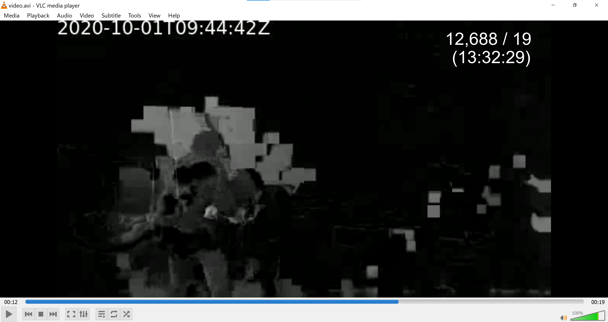

# Task 6 - Proof of Life

### (Signals Analysis)

#### Points: 1300

Satellite imaging of the location you identified shows a camouflaged building within the jungle. The recon team spotted multiple armed individuals as well as drones being used for surveillance. Due to this heightened security presence, the team was unable to determine whether or not the journalist is being held inside the compound. Leadership is reluctant to raid the compound without proof that the journalist is there.

The recon team has brought back a signal collected near the compound. They suspect it is a security camera video feed, likely encoded with a systematic Hamming code. The code may be extended and/or padded as well. We've used BPSK demodulation on the raw signal to generate a sequence of half precision floating point values. The floats are stored as IEEE 754 binary16 values in little-endian byte order within the attached file. Each float is a sample of the signal with 1 sample per encoded bit. You should be able to interpret this to recover the encoded bit stream, then determine the Hamming code used. Your goal for this task is to help us reproduce the original video to provide proof that the journalist is alive and being held at this compound.

### Provided files

* Collected Signal (`signal.ham`)

### Prompt

* Enter the parity check matrix used to decode the data stream. Enter in JSON format, as an array of arrays ie. a 3x2 matrix, on a single line (optional), might be: [[1,0],[0,0],[1,1]]
* Enter the RFC3339 timestamp in the surveillance video stream that proves the hostage was alive recently inside the compound.

### Prerequisites

```
~$ pip3 install numpy
```

## Solution

Let's begin by looking at some of the contents of `signal.ham`.

```
~$ python3
>>> from numpy import np
>>> np.fromfile('signal.ham', dtype=np.float16)[:10]
array([-0.5923,  1.2   , -1.506 ,  0.917 , -0.919 , -0.559 ,  0.5396,
       -1.1045, -1.322 ,  0.8516], dtype=float16)
```

We can convert the demodulated signal to a bit stream by passing each float through the threshold `0`. We want to determine the Hamming code used. We know that the block length must be a factor of the total number of bits in the bit stream. We therefore look for the first block length satisfying this property. We check all possible message lengths given this first block length and look for clues.

```python
#!/usr/bin/python3
# ham_code.py

from os import stat
import numpy as np

list2str = lambda l: ''.join(map(str,l))

num_bits = stat('signal.ham').st_size*8//16 # 8 bits per byte, 16-bit float
raw = [0 if x<0 else 1 for x in np.fromfile('signal.ham', dtype=np.float16)[:160]]
l = 3 # block length
while num_bits%l:
	l += 1
for k in range(3,l):
	s = list()
	for i in range(0,len(raw)-l,l):
		s += raw[i:i+l][:k]
	print('[%i,%i]: %s'%(l,k,''.join([chr(int(list2str(s[i:i+8]),2)) for i in range(0,len(s),8)])))
```

```
~$ ./ham_code.py
[17,3]: Jq
[17,4]: TŸ
[17,5]: Reá@
[17,6]: Q)<r
[17,7]: R–Gd
[17,8]: RJԖۃ
[17,9]: R%$~1’
[17,10]: RR‰ W$ 
[17,11]: RIFFxÑAVI 
[17,12]: RT£‘ŸL’ 
[17,13]: RRQäeãaÀ$

[17,14]: RU(ù|l¾ÐT2H 
[17,15]: RV”~FW‘ЁPä )
[17,16]: RWJ>‘”ñ³¼€4BÉ! R
```

As we can see, the smallest block length that is a factor of the total number of bits is `17`. We look at message length `11` and see that the file contains the strings `RIFF` and `AVI`. Since we know that our signal is a video, this is a good sign, this tells us that the Hamming code used might have been `[17,11]` and that the original video was an `AVI` file.

We know that Hamming code block lengths should take the form `2^r-1` for some `r>1` so our blocks are either padded or extended by 2 bits. Let's take a look at the bit stream.

```python
#!/usr/bin/python3
# ham_code.py
l = 17
k = 11

for i in range(0,len(raw)-l,l):
	print(raw[i:i+l])
```

```
~$ ./ham_code.py
[0, 1, 0, 1, 0, 0, 1, 0, 0, 1, 0, 1, 0, 1, 1, 1, 0]
[0, 1, 0, 0, 1, 0, 1, 0, 0, 0, 1, 1, 1, 1, 1, 0, 0]
[1, 0, 0, 1, 0, 0, 0, 1, 1, 0, 0, 1, 0, 1, 0, 0, 0]
[1, 1, 1, 1, 0, 0, 0, 1, 1, 0, 1, 1, 0, 0, 1, 1, 0]
[0, 0, 0, 1, 0, 0, 0, 0, 1, 0, 1, 1, 1, 1, 0, 0, 0]
[1, 0, 0, 0, 0, 0, 0, 0, 0, 0, 1, 1, 0, 1, 0, 0, 0]
[0, 0, 0, 0, 0, 1, 0, 1, 0, 1, 0, 0, 0, 0, 1, 0, 0]
[1, 1, 0, 0, 1, 0, 0, 1, 0, 0, 1, 0, 0, 0, 0, 1, 0]
[0, 0, 1, 0, 0, 0, 0, 0, 0, 1, 0, 1, 0, 0, 1, 0, 0]
```

We can see that the last bit is always a `0` so we have 1 bit of padding and 1 extended parity bit. We therefore have block length `16`, message length `11`, and 1 bit of padding.

We now find the most common parity bits and use this to construct our generator and parity check matrices.

```python
#!/usr/bin/python3
# decode.py

from collections import Counter
import json

n = 16
k = 11
p = 1

print('Reading from file...', end='')
raw = [0 if x<0 else 1 for x in np.fromfile('signal.ham', dtype=np.float16)]
print(' done')

d = list()
for i in range(k):
	d.append(Counter())

for i in range(0,len(raw)-n-p,n+p):
    block = raw[i:i+n+p]
    data = block[:k]
    par = block[k:n]
    if data.count(1) == 1:
    	d[data.index(1)][list2str(par)] += 1

P = list()
for row in d:
	P.append(list(int(x) for x in row.most_common(1)[0][0]))

G = np.append(np.identity(k, dtype=np.int), P, axis=1)
print('\ngenerator matrix G', G, sep='\n')
H = np.append(np.transpose(P), np.identity(n-k, dtype=np.int), axis=1)
print('\nparity check matrix H', json.dumps(H.tolist()), sep='\n')
```

```
~$ ./decode.py
Reading from file... done

generator matrix G
[[1 0 0 0 0 0 0 0 0 0 0 0 1 1 1 0]
 [0 1 0 0 0 0 0 0 0 0 0 1 0 1 1 0]
 [0 0 1 0 0 0 0 0 0 0 0 0 1 0 1 1]
 [0 0 0 1 0 0 0 0 0 0 0 1 0 1 0 1]
 [0 0 0 0 1 0 0 0 0 0 0 1 1 1 1 1]
 [0 0 0 0 0 1 0 0 0 0 0 0 0 1 1 1]
 [0 0 0 0 0 0 1 0 0 0 0 0 1 1 0 1]
 [0 0 0 0 0 0 0 1 0 0 0 1 1 1 0 0]
 [0 0 0 0 0 0 0 0 1 0 0 1 0 0 1 1]
 [0 0 0 0 0 0 0 0 0 1 0 1 1 0 0 1]
 [0 0 0 0 0 0 0 0 0 0 1 1 1 0 1 0]]

parity check matrix H
[[0, 1, 0, 1, 1, 0, 0, 1, 1, 1, 1, 1, 0, 0, 0, 0],
 [1, 0, 1, 0, 1, 0, 1, 1, 0, 1, 1, 0, 1, 0, 0, 0],
 [1, 1, 0, 1, 1, 1, 1, 1, 0, 0, 0, 0, 0, 1, 0, 0],
 [1, 1, 1, 0, 1, 1, 0, 0, 1, 0, 1, 0, 0, 0, 1, 0],
 [0, 0, 1, 1, 1, 1, 1, 0, 1, 1, 0, 0, 0, 0, 0, 1]]
```

We therefore have our parity check matrix. We can now use MATLAB's `syndtable` function to generate our syndrome table from the parity check matrix.

```matlab
>> t = syndtable([0, 1, 0, 1, 1, 0, 0, 1, 1, 1, 1, 1, 0, 0, 0, 0;
				  1, 0, 1, 0, 1, 0, 1, 1, 0, 1, 1, 0, 1, 0, 0, 0;
				  1, 1, 0, 1, 1, 1, 1, 1, 0, 0, 0, 0, 0, 1, 0, 0;
				  1, 1, 1, 0, 1, 1, 0, 0, 1, 0, 1, 0, 0, 0, 1, 0;
				  0, 0, 1, 1, 1, 1, 1, 0, 1, 1, 0, 0, 0, 0, 0, 1])
Single-error patterns loaded in decoding table.  15 rows remaining.
2-error patterns loaded.  0 rows remaining.

t =

     0     0     0     0     0     0     0     0     0     0     0     0     0     0     0     0
     0     0     0     0     0     0     0     0     0     0     0     0     0     0     0     1
     0     0     0     0     0     0     0     0     0     0     0     0     0     0     1     0
     1     0     0     0     0     0     1     0     0     0     0     0     0     0     0     0
     0     0     0     0     0     0     0     0     0     0     0     0     0     1     0     0
     1     0     1     0     0     0     0     0     0     0     0     0     0     0     0     0
     1     0     0     0     0     0     0     0     0     0     0     0     1     0     0     0
     0     0     0     0     0     1     0     0     0     0     0     0     0     0     0     0
     0     0     0     0     0     0     0     0     0     0     0     0     1     0     0     0
     1     0     0     0     0     1     0     0     0     0     0     0     0     0     0     0
     1     0     0     0     0     0     0     0     0     0     0     0     0     1     0     0
     0     0     1     0     0     0     0     0     0     0     0     0     0     0     0     0
     1     0     0     0     0     0     0     0     0     0     0     0     0     0     1     0
     0     0     0     0     0     0     1     0     0     0     0     0     0     0     0     0
     1     0     0     0     0     0     0     0     0     0     0     0     0     0     0     0
     1     0     0     0     0     0     0     0     0     0     0     0     0     0     0     1
     0     0     0     0     0     0     0     0     0     0     0     1     0     0     0     0
     1     0     0     0     1     0     0     0     0     0     0     0     0     0     0     0
     1     0     0     0     0     0     0     1     0     0     0     0     0     0     0     0
     0     0     0     0     0     0     0     0     1     0     0     0     0     0     0     0
     1     0     0     0     0     0     0     0     0     0     1     0     0     0     0     0
     0     0     0     1     0     0     0     0     0     0     0     0     0     0     0     0
     0     1     0     0     0     0     0     0     0     0     0     0     0     0     0     0
     1     0     0     0     0     0     0     0     0     1     0     0     0     0     0     0
     1     1     0     0     0     0     0     0     0     0     0     0     0     0     0     0
     0     0     0     0     0     0     0     0     0     1     0     0     0     0     0     0
     0     0     0     0     0     0     0     0     0     0     1     0     0     0     0     0
     1     0     0     1     0     0     0     0     0     0     0     0     0     0     0     0
     0     0     0     0     0     0     0     1     0     0     0     0     0     0     0     0
     1     0     0     0     0     0     0     0     1     0     0     0     0     0     0     0
     1     0     0     0     0     0     0     0     0     0     0     1     0     0     0     0
     0     0     0     0     1     0     0     0     0     0     0     0     0     0     0     0
```

We can now use this syndrome table to correct errors in the input as we see them. We will write all corrected data bits to an `AVI` file since we saw that in the file header.

```python
synd = """0     0     0     0     0     0     0     0     0     0     0     0     0     0     0     0
0     0     0     0     0     0     0     0     0     0     0     0     0     0     0     1
0     0     0     0     0     0     0     0     0     0     0     0     0     0     1     0
1     0     0     0     0     0     1     0     0     0     0     0     0     0     0     0
0     0     0     0     0     0     0     0     0     0     0     0     0     1     0     0
1     0     1     0     0     0     0     0     0     0     0     0     0     0     0     0
1     0     0     0     0     0     0     0     0     0     0     0     1     0     0     0
0     0     0     0     0     1     0     0     0     0     0     0     0     0     0     0
0     0     0     0     0     0     0     0     0     0     0     0     1     0     0     0
1     0     0     0     0     1     0     0     0     0     0     0     0     0     0     0
1     0     0     0     0     0     0     0     0     0     0     0     0     1     0     0
0     0     1     0     0     0     0     0     0     0     0     0     0     0     0     0
1     0     0     0     0     0     0     0     0     0     0     0     0     0     1     0
0     0     0     0     0     0     1     0     0     0     0     0     0     0     0     0
1     0     0     0     0     0     0     0     0     0     0     0     0     0     0     0
1     0     0     0     0     0     0     0     0     0     0     0     0     0     0     1
0     0     0     0     0     0     0     0     0     0     0     1     0     0     0     0
1     0     0     0     1     0     0     0     0     0     0     0     0     0     0     0
1     0     0     0     0     0     0     1     0     0     0     0     0     0     0     0
0     0     0     0     0     0     0     0     1     0     0     0     0     0     0     0
1     0     0     0     0     0     0     0     0     0     1     0     0     0     0     0
0     0     0     1     0     0     0     0     0     0     0     0     0     0     0     0
0     1     0     0     0     0     0     0     0     0     0     0     0     0     0     0
1     0     0     0     0     0     0     0     0     1     0     0     0     0     0     0
1     1     0     0     0     0     0     0     0     0     0     0     0     0     0     0
0     0     0     0     0     0     0     0     0     1     0     0     0     0     0     0
0     0     0     0     0     0     0     0     0     0     1     0     0     0     0     0
1     0     0     1     0     0     0     0     0     0     0     0     0     0     0     0
0     0     0     0     0     0     0     1     0     0     0     0     0     0     0     0
1     0     0     0     0     0     0     0     1     0     0     0     0     0     0     0
1     0     0     0     0     0     0     0     0     0     0     1     0     0     0     0
0     0     0     0     1     0     0     0     0     0     0     0     0     0     0     0"""

syndtable = [[int(y) for y in x.split()] for x in synd.splitlines()]

out = ''
for i in range(0,len(raw)-n-p,n+p):
	block = raw[i:i+n+p]
	c = raw[i:i+n]
	syndrome = int(list2str(np.matmul(c,np.transpose(H))%2),2)
	if syndrome:
		err = syndtable[syndrome]
		c = np.add(c,err)%2
	out += list2str(c[:k])

bit_strings = [out[i:i+8] for i in range(0,len(out),8)]
byte_list = [int(b,2) for b in bit_strings]
with open('video.avi', 'wb') as f:
	f.write(bytearray(byte_list))
```

We now open `video.avi` using a media player such as VLC.




We see the hostage. Our first sighting of him is at timestamp `2020-10-01T09:44:42Z` so that is our desired timestamp.

### Answer

* Enter the parity check matrix used to decode the data stream. Enter in JSON format, as an array of arrays ie. a 3x2 matrix, on a single line (optional), might be: [[1,0],[0,0],[1,1]]
	* `[[0, 1, 0, 1, 1, 0, 0, 1, 1, 1, 1, 1, 0, 0, 0, 0], [1, 0, 1, 0, 1, 0, 1, 1, 0, 1, 1, 0, 1, 0, 0, 0], [1, 1, 0, 1, 1, 1, 1, 1, 0, 0, 0, 0, 0, 1, 0, 0], [1, 1, 1, 0, 1, 1, 0, 0, 1, 0, 1, 0, 0, 0, 1, 0], [0, 0, 1, 1, 1, 1, 1, 0, 1, 1, 0, 0, 0, 0, 0, 1]]`
* Enter the RFC3339 timestamp in the surveillance video stream that proves the hostage was alive recently inside the compound.
  * `2020-10-01T09:44:42Z`

## Author

* **Aviv Brook**